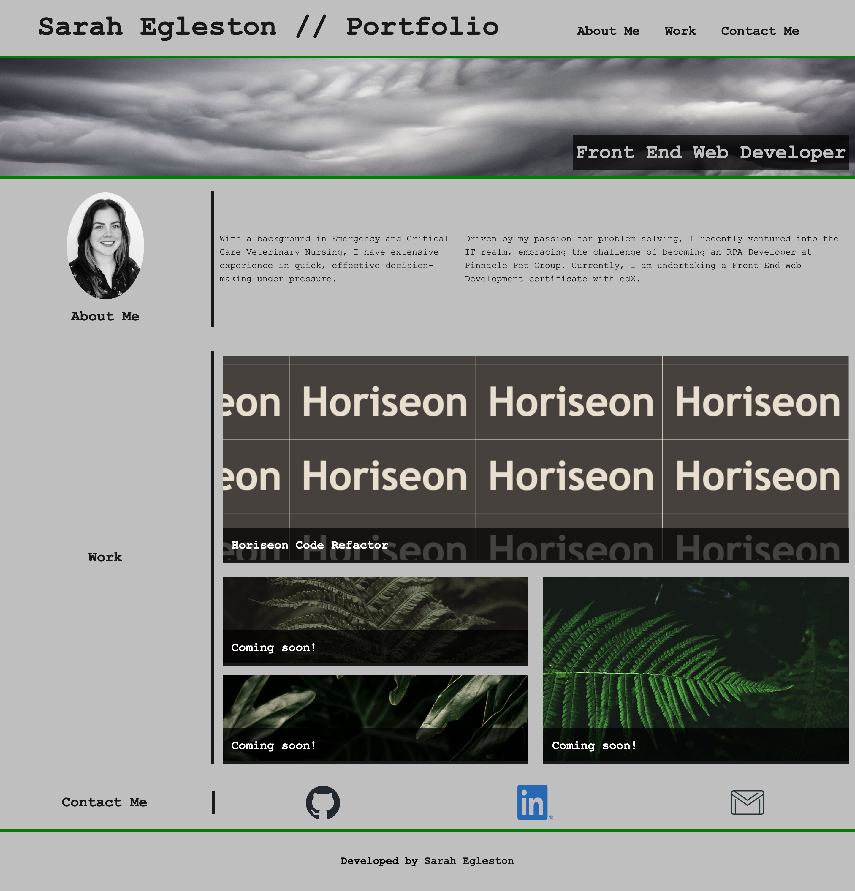

# sarah-egleston-portfolio

## Description

This is my portfolio project, toshowcase my skills in html and css which I have recently devleped with a Front End Web Development bootcamp with EdX.

## Installation

N/A

## Usage
Live link: https://segleston.github.io/sarah-egleston-portfolio/

There is a header and navigation section to let the user know who the portfolio belongs to, and links to each section; About me, Work and a section for users to be able to contact me. Further down the page, there are sections dedicated to the above topics and links to examples of my previous projects. 

Please see screenshots of page:

## Credits

- grid photos and hero banner photo: https://www.pexels.com
- CSS tips: https://www.w3schools.com/
- flexbox learning: https://courses.wesbos.com/
- Linkedin logo: https://brand.linkedin.com/downloads
- Smooth scrolling: https://css-tricks.com/snippets/jquery/smooth-scrolling/
- Github logo: https://github.com/logos
- Grid learning: https://css-tricks.com/snippets/css/complete-guide-grid/
- Reset CSS: https://github.com/necolas/

## License

Please refer to the license in the repo.